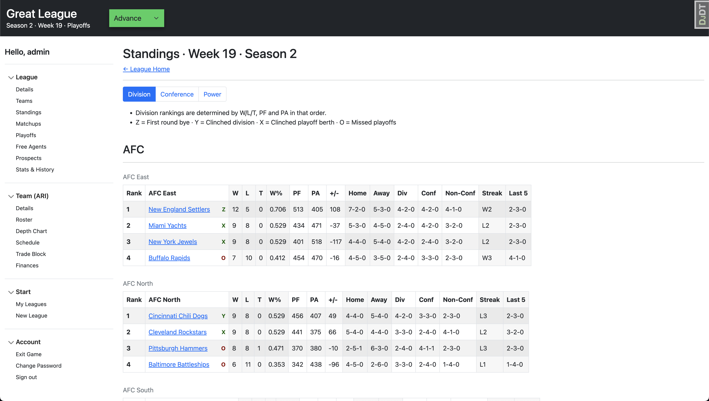

# Move the Chains (MTC) Football

Move the Chains is a web-based (American) football simulation game built with Python, Django, Bootstrap and Vanilla JS.



Although it's semi-playable in its current state, a lot of work still needs to be done before a production version can be released.

Currently, you can simulate full seasons but the game results are based on a random coin flip. Game statistics and management functions like trading or free agent signing have also yet to be added.

In its current state, the game is really just a simple football matchup engine with a schedule, standings, playoffs, teams, and placeholder players.

The reasoning behind this was to make the game functional as quickly as possible. Once the league operations and management portions of the game are built out to a substantial level, then the simulation engine can be improved upon incrementally without sacrificing playability.

# Is there a hosted version of the game?

Not currently. There are plans to release a publicly hosted beta version of the game eventually. However, the management portion of the game still needs some work before that can happen. A basic simulation engine would be a nice touch as well so the game results aren't so random.

You are welcome to run a version locally to test it out in the meantime. With that said, please don't host your own public version of the code anywhere. Feel free to review the [LICENSE.md](https://github.com/wjh18/mtc-football/blob/master/LICENSE.md) for more guidelines surrounding this limitation.

See the installation instructions below for details on how to setup a local version of the game for testing purposes.

## Installation

The project uses Docker / docker-compose for local development and Pipenv to manage Python dependencies. You will need to install Docker locally for the most streamlined setup experience. In the future, more flexible ways to spin up a development environment will be added for those who prefer alternative tools like pip and requirements.txt.

Fork the repository and clone your fork (if contributing) or clone the original repository (if testing only):

`git clone https://github.com/wjh18/mtc-football.git`

`cd mtc-football`

Create a local env file:

`touch .env.dev`

Add the following to `.env.dev`:
```
DJANGO_SECRET_KEY={SECRET_KEY}
DJANGO_DEBUG=True
```

Build the image and stand up the container in detached mode (this may take a few minutes):

`docker-compose up -d --build`

To generate a random secret key, use the following:

`docker-compose exec web python manage.py shell`
```python
from django.core.management.utils import get_random_secret_key  
get_random_secret_key()
```

Copy the secret key into your `.env.dev` file without the single quotes.

Migrate the database:

`docker-compose exec web python manage.py migrate`

Create a superuser:

`docker-compose exec web python manage.py createsuperuser`

Now you should be able to login with your superuser via the GUI or Django Admin. You can also use the signup flow to create a user but you won't be able to log into the Django Admin with it.

Tear down the container after the initial build:

`docker-compose down`

Stand up the container after the initial build:

`docker-compose up -d`

That's it! Now you can create a league, select a team, simulate a few seasons or explore the UI. Whatever your heart desires.

*Note: django-debug-toolbar is installed by default which slows down page load significantly. To improve performance, uncheck all the boxes in the sidebar GUI.*

# How to Contribute

Please see [CONTRIBUTING.md](https://github.com/wjh18/mtc-football/blob/master/CONTRIBUTING.md) for details on how to contribute to the codebase.